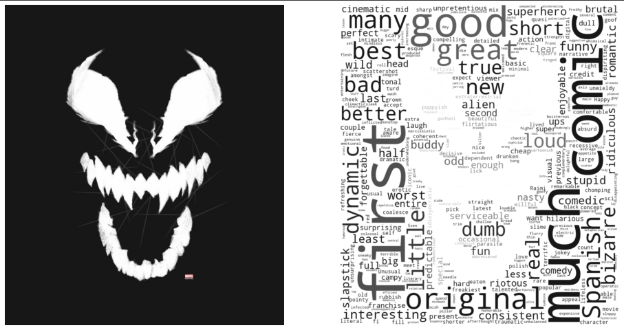

# What did the critics think of Venom - Let There Be Carnage?

In this project I created a word cloud with the adjectives that critics gave to the film. 

Using Python and Google Colab, the steps followed were: 

- I stored the <a href="https://www.rottentomatoes.com/">RottenTomatoes</a> site reviews in .csv; 
- Tokenization was performed and stopwords removed, using the <a href="https://www.nltk.org/">NLTK</a> package; 
- Again using the NLTK package, only the adjectives were filtered;
- Using Matplotlib and wordcloud, the word cloud was generated based on the mask of the anti-hero Venom. 

And the result was:

  

